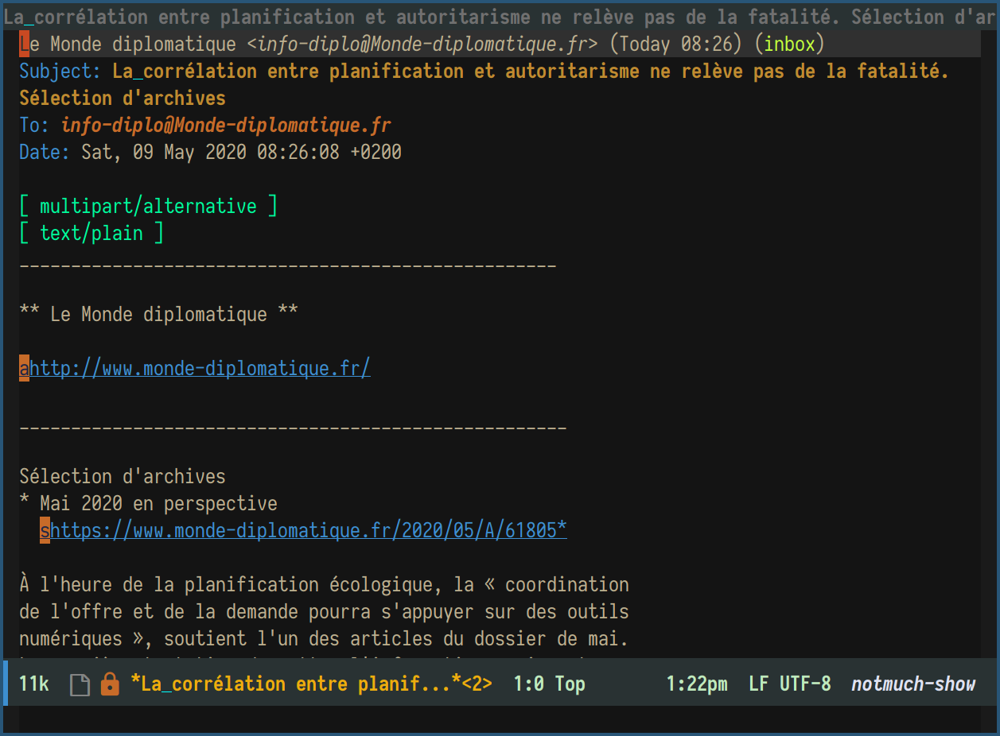
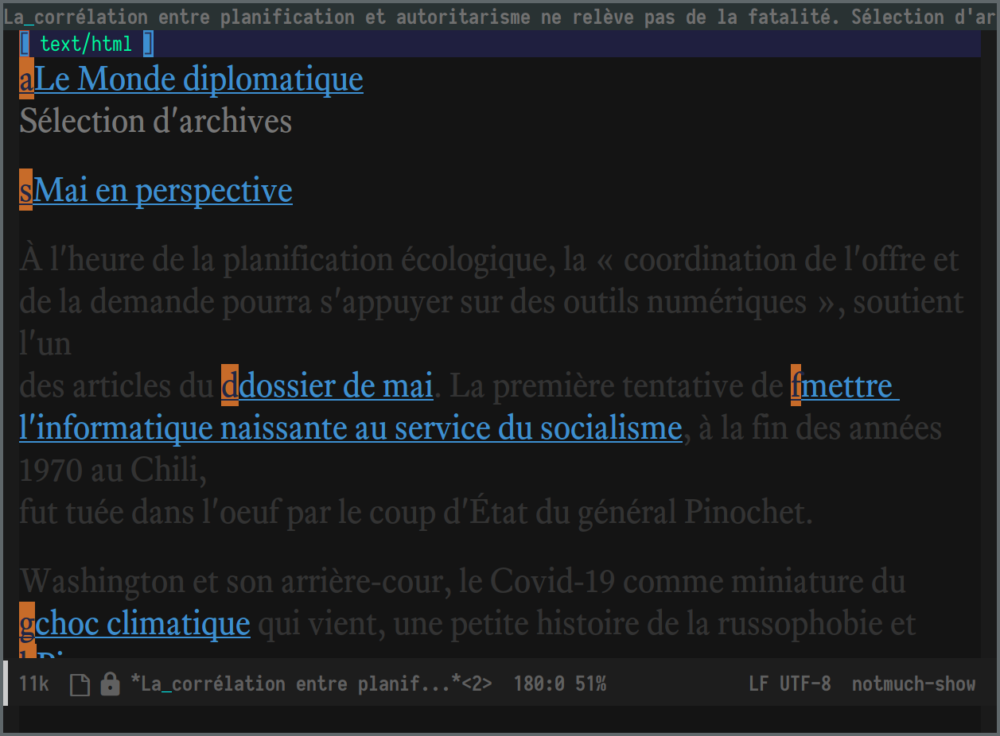

ace-link-notmuch-show
============

Description
---------------

This library provides a [`ace-link`](https://github.com/abo-abo/ace-link) handler for links displayed in a `notmuch-show` buffer.  It will work with both `text/plain` and `text/html`.

Screenshots
---------------






Installation
---------------

Since the package is not on MELPA, you have to clone the repository somewhere in your `load-path`.

To do that:
1. Create a directory where you’d like to clone the repository, e.g. `mkdir ~/projects`.
2. `cd ~/projects`
3. `git clone https://github.com/zaeph/ace-link-notmuch-show.git`

Quick-start 🚀
---------------

You can get `ace-link-notmuch-show` up and running by pasting the following sexps in your [init-file](https://www.gnu.org/software/emacs/manual/html_node/emacs/Init-File.html):

### With `use-package`

```el
(use-package ace-link-notmuch-show
  :load-path "~/projects/ace-link-notmuch-show/" ;Modify with your own path
  :bind (:map notmuch-show-mode-map
         ("o" . ace-link-notmuch-show)))
```

### Without `use-package`
```el
(add-to-list 'load-path "~/projects/ace-link-notmuch-show/") ;Modify with your own path
(require 'ace-link-notmuch-show)
(define-key notmuch-show-mode-map (kbd "o") #'ace-link-notmuch-show)
```
